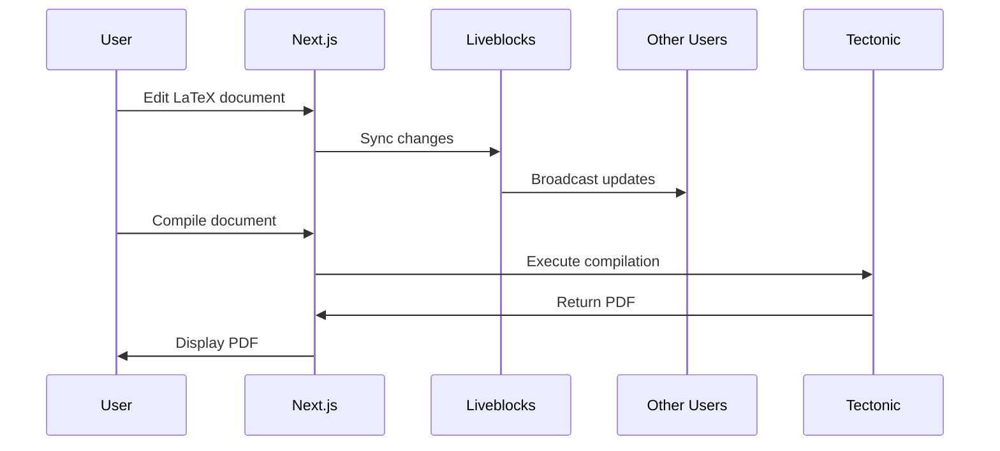

## Why self-host Typeset

Self-hosting Typeset gives you complete control over your LaTeX editing environment. Consider self-hosting if you:

- Need to keep documents within your organization's infrastructure
- Want to customize the AI models or LaTeX compilation pipeline
- Require integration with internal authentication systems
- Need to deploy in air-gapped or restricted environments
- Want to avoid vendor lock-in

The official hosted version at [typeset.im](https://www.typeset.im) is maintained by the Typeset team and includes automatic updates, backups, and support.

## Architecture overview

Typeset is built on a modern serverless architecture:

<Note>
  Self-hosted instances require proper configuration of external services for full functionality.
</Note>

### Core components

**Next.js application**

The frontend and API are built with Next.js 15, using React 19 and TypeScript. The application uses server-side rendering and API routes for backend logic.

**Tectonic LaTeX compiler**

Typeset uses the [Tectonic](https://tectonic-typesetting.github.io/) LaTeX engine to compile documents to PDF. The Tectonic binary (`~/bin/tectonic`) must be included in your deployment.

- Linux: Pre-built binary included in `bin/tectonic`
- macOS: Install via `/usr/local/bin/tectonic`
- Platform-specific paths are configured in `app/api/compile/route.ts:22-25`

**Authentication layer**

User authentication is handled by [Clerk](https://clerk.com). Protected routes include:
- `/my-projects`
- `/shared-with-me`
- `/project/*`

**Real-time collaboration**

[Liveblocks](https://liveblocks.io) powers real-time collaborative editing using Yjs for conflict-free replicated data types (CRDTs).

**AI integration**

The AI assistant supports multiple models through Vercel's AI SDK:
- OpenAI GPT-4.1-mini (default)
- Google Gemini 2.5 Flash

### Data flow

## System requirements

### Server requirements

- **Node.js**: 20.x or later
- **Memory**: Minimum 512 MB, recommended 2 GB
- **Storage**: 500 MB for application + cache space for LaTeX packages
- **Platform**: Linux (x86_64) or macOS

<Warning>
  Tectonic downloads LaTeX packages on-demand. Ensure sufficient disk space and internet connectivity for package downloads.
</Warning>

### External services

Required third-party services:

1. **Clerk** - User authentication
2. **Liveblocks** - Real-time collaboration
3. **OpenAI or Google AI** - AI assistant functionality
4. **Vercel** (recommended) - Hosting and deployment

## Deployment options

Typeset can be deployed to any platform that supports Next.js:

- **Vercel** (recommended) - Zero-config deployment with automatic scaling
- **Docker** - Containerized deployment for any cloud provider
- **Self-managed** - Deploy to your own servers with Node.js

See [Deployment](/self-hosting/deployment) for detailed instructions.

## Security considerations

<Warning>
  Self-hosting requires you to manage security, including keeping dependencies updated and securing API keys.
</Warning>

Key security considerations:

- Keep environment variables secure (never commit to version control)
- Use HTTPS for all production deployments
- Regularly update dependencies for security patches
- Configure Clerk webhook signing secrets
- Restrict API access with proper CORS settings
- Monitor LaTeX compilation for resource exhaustion

## Limitations

When self-hosting, you are responsible for:

- Maintaining uptime and availability
- Backing up user data (handled by external services)
- Scaling infrastructure as usage grows
- Applying security updates
- Debugging issues without official support

## Next steps

<Steps>
  <Step title="Install Typeset">
    Follow the [installation guide](/self-hosting/installation) to set up your local environment.
  </Step>
  
  <Step title="Configure services">
    Set up API keys and environment variables in the [configuration guide](/self-hosting/configuration).
  </Step>
  
  <Step title="Deploy">
    Deploy to Vercel or your preferred platform using the [deployment guide](/self-hosting/deployment).
  </Step>
</Steps>